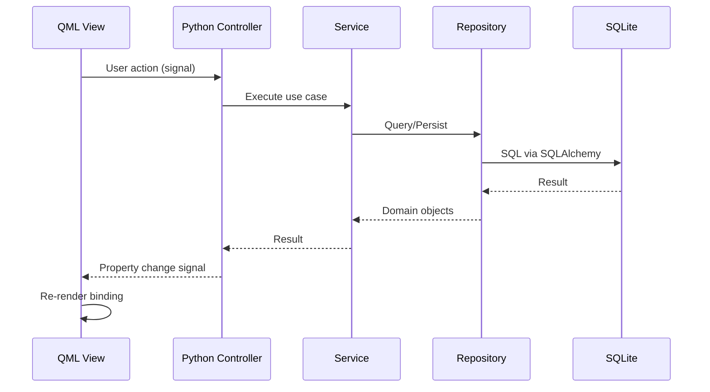
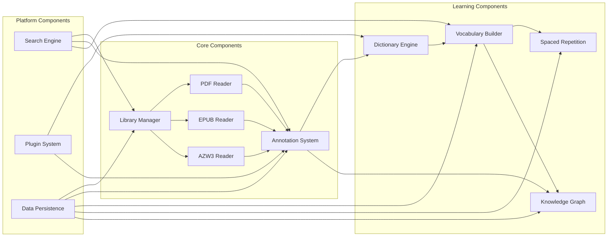
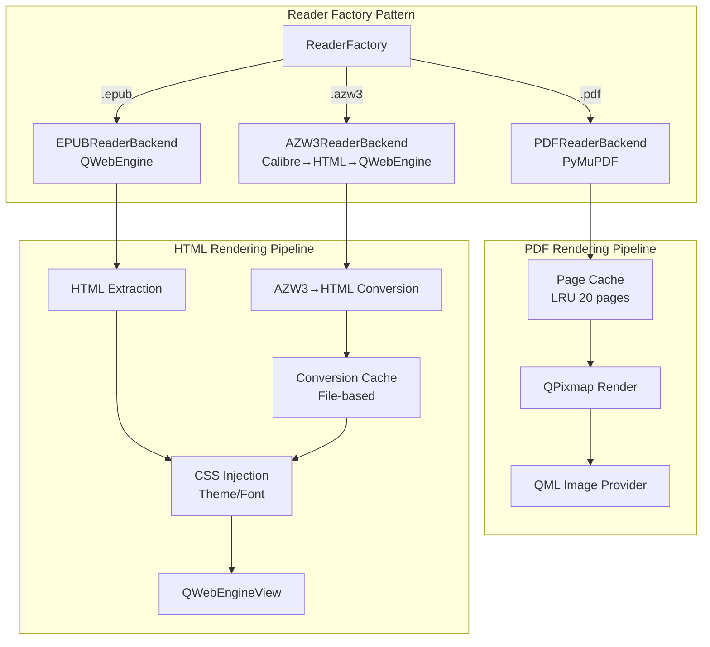
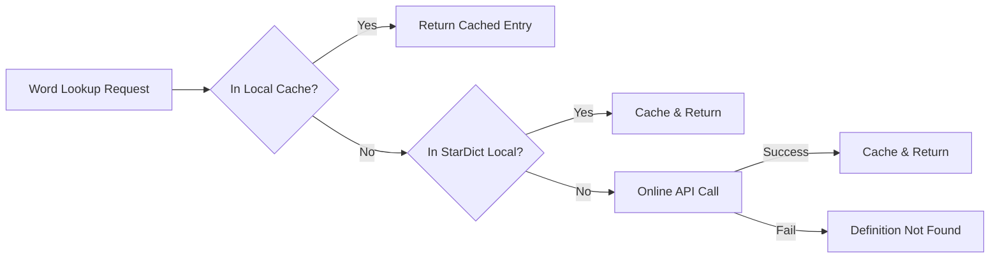
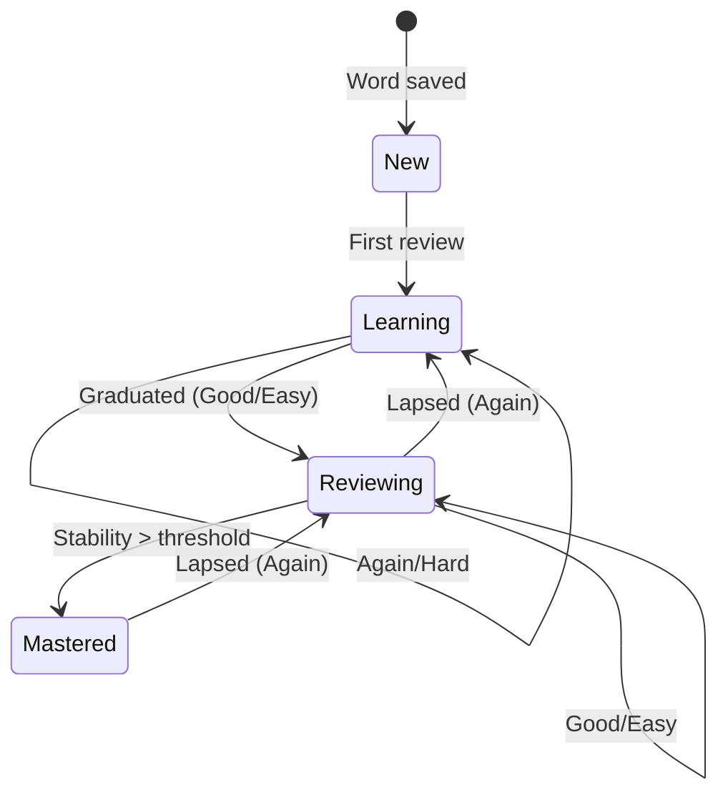
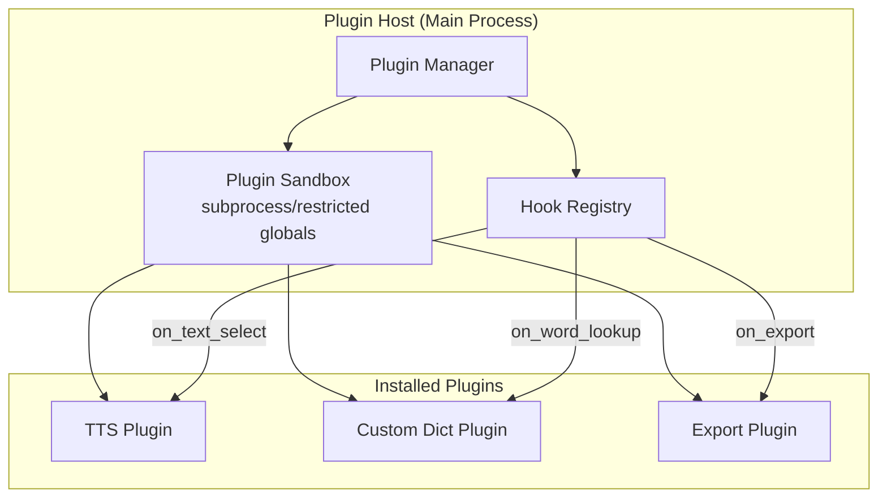
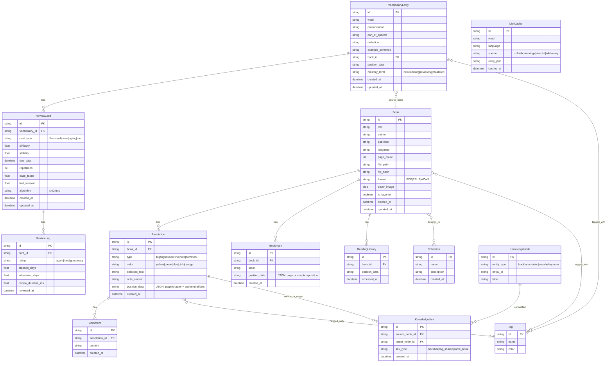

# Design Document: AI Ebook Reader & Vocabulary Learning Platform

## Overview

This document describes the technical design for a desktop ebook reader and vocabulary learning platform built with PySide6 + Qt Quick (QML). The application combines ebook reading (PDF, EPUB, AZW3), annotation management, dictionary lookup, vocabulary building with spaced repetition, and a knowledge graph — all backed by a local SQLite database.

The architecture follows Clean Architecture principles with four layers: Presentation (QML), Application (Services), Domain (Models/Entities), and Infrastructure (Database, Parsers, Dictionary APIs). Communication between QML and Python uses Qt's property binding and signal/slot mechanism.

### Key Design Decisions

| Decision | Choice | Rationale |
|----------|--------|-----------|
| UI Framework | PySide6 + QML | Modern declarative UI, hardware-accelerated rendering, responsive animations |
| PDF Engine | PyMuPDF (fitz) | Fastest Python PDF library, C-based MuPDF engine, excellent text extraction |
| EPUB/AZW3 Rendering | QWebEngine | Full HTML/CSS rendering, JavaScript bridge for annotations |
| Database | SQLite + SQLAlchemy | Zero-config, WAL for crash recovery, FTS5 for search, single-file portability |
| Async | asyncio + QAsync | Non-blocking I/O for network calls and file parsing without freezing UI |
| Spaced Repetition | FSRS (default) + SM2 | FSRS is state-of-the-art; SM2 for users familiar with Anki's legacy algorithm |
| Packaging | PyInstaller | Single-executable distribution for Windows/macOS/Linux |

## Architecture

### High-Level Architecture Diagram

```mermaid
graph TB
    subgraph Presentation["Presentation Layer (QML)"]
        MainWindow[MainWindow.qml]
        LibraryView[LibraryView.qml]
        PDFReader[PDFReaderView.qml]
        EPUBReader[EPUBReaderView.qml]
        DictPopup[DictionaryPopup.qml]
        VocabPanel[VocabularyPanel.qml]
        ReviewView[ReviewSessionView.qml]
        GraphView[KnowledgeGraphView.qml]
    end

    subgraph Application["Application Layer (Python Services)"]
        LibrarySvc[LibraryService]
        ReaderSvc[ReaderService]
        AnnotationSvc[AnnotationService]
        DictSvc[DictionaryService]
        VocabSvc[VocabularyService]
        SRSvc[SpacedRepetitionService]
        SearchSvc[SearchService]
        GraphSvc[KnowledgeGraphService]
        PluginSvc[PluginService]
    end

    subgraph Domain["Domain Layer (Models & Business Logic)"]
        BookModel[Book]
        AnnotationModel[Annotation]
        VocabModel[VocabularyEntry]
        CardModel[ReviewCard]
        GraphModel[KnowledgeNode]
        SRAlgo[SR Algorithms<br/>SM2 / FSRS]
    end

    subgraph Infrastructure["Infrastructure Layer"]
        SQLiteDB[(SQLite DB)]
        PyMuPDF[PyMuPDF Engine]
        EPUBParser[EPUB Parser]
        AZW3Parser[AZW3/Calibre Parser]
        DictCache[Dictionary Cache]
        DictAPI[Dictionary APIs<br/>Oxford/Cambridge/StarDict]
        FTS5[SQLite FTS5 Index]
        PluginLoader[Plugin Loader]
    end

    Presentation --> Application
    Application --> Domain
    Application --> Infrastructure
    Domain --> Infrastructure
```



### Layer Responsibilities

**Presentation Layer (QML)**
- Declarative UI components using Qt Quick Controls
- Data binding to Python backend via QObject properties and signals
- No business logic — only display and user interaction forwarding
- Uses Qt Quick's ListView, GridView for performant list rendering
- QWebEngineView for EPUB/AZW3 HTML content rendering

**Application Layer (Python Services)**
- Orchestrates use cases by coordinating domain objects and infrastructure
- Exposes QObject-based controllers to QML via `setContextProperty` or `qmlRegisterType`
- Handles async operations (file I/O, network) using asyncio integrated with Qt event loop
- Emits signals to notify QML of state changes

**Domain Layer (Models & Business Logic)**
- Pure Python dataclasses/entities with no framework dependencies
- Business rules: SR algorithm calculations, annotation merging, collection membership
- Value objects: TextPosition, HighlightColor, MasteryLevel enums

**Infrastructure Layer**
- SQLAlchemy ORM models mapped to SQLite tables
- File parsers (PyMuPDF, EPUB parser, Calibre-based AZW3 parser)
- Dictionary API clients with caching layer
- Plugin sandbox and loader
- FTS5 index management

### Communication Between Layers



The Python controllers inherit from `QObject` and expose:
- `@Property` decorators for read-only data binding
- `@Slot` decorators for methods callable from QML
- `Signal` objects for notifying QML of async state changes

## Components and Interfaces

### Component Diagram



### Key Interfaces

```python
# --- Application Layer Interfaces ---

class ILibraryService(Protocol):
    def import_files(self, paths: list[Path]) -> list[Book]: ...
    def import_folder(self, folder: Path, recursive: bool = True) -> list[Book]: ...
    def get_books(self, sort_by: SortCriterion, filter: BookFilter | None) -> list[Book]: ...
    def create_collection(self, name: str) -> Collection: ...
    def add_to_collection(self, book_id: str, collection_id: str) -> None: ...
    def add_tag(self, book_id: str, tag: str) -> None: ...
    def set_favorite(self, book_id: str, is_favorite: bool) -> None: ...
    def record_open(self, book_id: str, position: ReadingPosition) -> None: ...

class IReaderService(Protocol):
    def open_book(self, book_id: str) -> ReaderState: ...
    def get_page(self, page_num: int, zoom: float) -> RenderedPage: ...
    def search_text(self, query: str) -> list[SearchMatch]: ...
    def get_toc(self) -> list[TocEntry]: ...

class IAnnotationService(Protocol):
    def create_annotation(self, book_id: str, position: TextPosition,
                          ann_type: AnnotationType, color: HighlightColor | None,
                          content: str | None) -> Annotation: ...
    def get_annotations(self, book_id: str) -> list[Annotation]: ...
    def add_comment(self, annotation_id: str, content: str) -> Comment: ...
    def add_tag(self, annotation_id: str, tag: str) -> None: ...
    def delete_annotation(self, annotation_id: str) -> None: ...
    def export_markdown(self, book_id: str) -> str: ...

class IDictionaryService(Protocol):
    def lookup(self, word: str, source: DictSource | None = None) -> DictEntry: ...
    def get_available_sources(self) -> list[DictSource]: ...

class IVocabularyService(Protocol):
    def save_word(self, word: str, entry: DictEntry, book_id: str,
                  position: TextPosition) -> VocabularyEntry: ...
    def get_vocabulary(self, filter: VocabFilter | None) -> list[VocabularyEntry]: ...
    def update_entry(self, entry_id: str, updates: VocabUpdate) -> VocabularyEntry: ...
    def delete_entry(self, entry_id: str) -> None: ...
    def export(self, format: ExportFormat) -> bytes: ...

class ISpacedRepetitionService(Protocol):
    def start_session(self, deck_filter: DeckFilter | None) -> ReviewSession: ...
    def get_next_card(self, session_id: str) -> ReviewCard | None: ...
    def rate_card(self, card_id: str, rating: Rating) -> ScheduleResult: ...
    def get_daily_stats(self) -> DailyStats: ...
    def switch_algorithm(self, algorithm: SRAlgorithm) -> None: ...

class ISearchService(Protocol):
    def search(self, query: str) -> SearchResults: ...
    def update_index(self, entity_type: str, entity_id: str) -> None: ...

class IKnowledgeGraphService(Protocol):
    def get_graph(self, filter: GraphFilter | None) -> Graph: ...
    def create_backlink(self, source_id: str, target_id: str) -> Link: ...
    def get_node_connections(self, node_id: str) -> list[Link]: ...

class IPluginService(Protocol):
    def install_plugin(self, path: Path) -> PluginInfo: ...
    def enable_plugin(self, plugin_id: str) -> None: ...
    def disable_plugin(self, plugin_id: str) -> None: ...
    def get_plugins(self) -> list[PluginInfo]: ...
    def execute_hook(self, hook: HookType, context: dict) -> Any: ...
```

### Reader Architecture Detail



**PDF Reader Backend:**
- Uses PyMuPDF `fitz.Document` for page access
- Renders pages to `QPixmap` via `page.get_pixmap(matrix=zoom_matrix)`
- LRU cache of 20 rendered pages for smooth scrolling (pre-renders ±3 pages)
- Text extraction via `page.get_text("dict")` for selection and search
- Annotations stored as overlay coordinates, not embedded in PDF

**EPUB Reader Backend:**
- Parses EPUB zip structure to extract HTML chapters, CSS, images
- Injects custom CSS for font settings, theme (dark mode), and annotation highlights
- JavaScript bridge (`QWebChannel`) for text selection events and annotation rendering
- Pagination mode uses CSS column splitting; scroll mode uses natural flow

**AZW3 Reader Backend:**
- Conversion pipeline: AZW3 → Calibre ebook-convert (subprocess) → HTML + images
- Caches converted HTML in `~/.ai-ebook-reader/cache/azw3/{hash}/`
- After conversion, reuses EPUB rendering pipeline (QWebEngine + CSS injection)
- Progress reporting via subprocess stdout parsing

### Dictionary Engine Architecture



The Dictionary Engine follows a chain-of-responsibility pattern:
1. **Local Cache** (SQLite table `dict_cache`) — O(1) lookup by word+language
2. **StarDict Local** — Pre-installed offline dictionaries in StarDict format
3. **Online APIs** — Configurable priority: Oxford → Cambridge → Merriam Webster → Wiktionary

Each source returns a normalized `DictEntry` containing: word, IPA pronunciation, parts of speech with definitions, example sentences, and synonyms.

### Spaced Repetition Engine Architecture



The engine supports two scheduling algorithms via Strategy pattern:

```python
class ISchedulingAlgorithm(Protocol):
    def calculate_next_review(self, card: ReviewCard, rating: Rating) -> ScheduleResult: ...
    def get_initial_intervals(self) -> list[float]: ...
```

#### SM2 Algorithm

SM2 (SuperMemo 2) uses an ease factor (EF) that adjusts based on response quality:

```
Input: quality q (0-5 scale, mapped from Again=0, Hard=2, Good=3, Easy=5)

If q >= 3 (pass):
    if repetition == 0: interval = 1 day
    elif repetition == 1: interval = 6 days
    else: interval = previous_interval * EF
    repetition += 1
Else (fail):
    repetition = 0
    interval = 1 day

EF = EF + (0.1 - (5 - q) * (0.08 + (5 - q) * 0.02))
EF = max(EF, 1.3)  # Minimum ease factor

Output: next_review_date = today + interval, updated EF
```

#### FSRS Algorithm (Default)

FSRS (Free Spaced Repetition Scheduler) uses a DSR model with three memory states:
- **Difficulty (D)**: How hard the card is (range 1-10)
- **Stability (S)**: Time (in days) for retrievability to drop to 90%
- **Retrievability (R)**: Probability of recall at current moment

Core formulas (based on [FSRS v4 algorithm](https://github.com/open-spaced-repetition/fsrs4anki/wiki/The-Algorithm)):

```
# Retrievability decay
R(t, S) = (1 + t / (9 * S))^(-1)

# After successful review (rating ∈ {Hard, Good, Easy}):
S'_recall(D, S, R, rating) = S * (1 + exp(w[8]) *
    (11 - D) * S^(-w[9]) * (exp(w[10] * (1 - R)) - 1) *
    (hard/good/easy_multiplier))

# After failed review (Again):
S'_forget(D, S, R) = w[11] * D^(-w[12]) * ((S + 1)^w[13] - 1) * exp(w[14] * (1 - R))

# Difficulty update:
D'(D, rating) = D - w[6] * (rating - 3)
D' = clamp(D', 1, 10)

# Initial stability for new cards (by rating):
S_0(rating) = w[rating - 1]  # w[0..3] are initial stability parameters

# Default parameters (17 weights):
w = [0.4, 0.6, 2.4, 5.8, 4.93, 0.94, 0.86, 0.01, 1.49, 0.14,
     0.94, 2.18, 0.05, 0.34, 1.26, 0.29, 2.61]
```

**Scheduling:**
- Desired retention: configurable (default 0.9)
- Next interval: `S * 9 * (1/desired_retention - 1)` (derived from R formula, solving for t when R = desired_retention)

### Plugin System Architecture



Plugin structure:
```
my-plugin/
├── plugin.json          # Metadata: name, version, author, hooks
├── __init__.py          # Entry point
├── requirements.txt     # Dependencies (installed in isolated venv)
└── assets/              # Plugin-specific resources
```

Plugin API hooks:
- `on_word_lookup(word, context)` → Can provide additional definitions
- `on_text_process(text)` → Text transformation (TTS, translation)
- `on_export(annotations, format)` → Custom export formats
- `on_import(file_path)` → Custom file format support
- `on_ui_extend(panel)` → Register custom UI panels

Isolation: Plugins execute in a restricted namespace with limited access. File I/O is restricted to plugin's own data directory. Network access requires explicit permission declaration in `plugin.json`.

## Data Models

### Entity Relationship Diagram



### SQLAlchemy Model Examples

```python
from sqlalchemy import Column, String, Integer, Float, Boolean, DateTime, ForeignKey, Text, Enum
from sqlalchemy.orm import DeclarativeBase, relationship
from datetime import datetime
import enum

class Base(DeclarativeBase):
    pass

class BookFormat(enum.Enum):
    PDF = "pdf"
    EPUB = "epub"
    AZW3 = "azw3"

class MasteryLevel(enum.Enum):
    NEW = "new"
    LEARNING = "learning"
    REVIEWING = "reviewing"
    MASTERED = "mastered"

class Rating(enum.Enum):
    AGAIN = 1
    HARD = 2
    GOOD = 3
    EASY = 4

class Book(Base):
    __tablename__ = "books"
    id = Column(String, primary_key=True)
    title = Column(String, nullable=False)
    author = Column(String)
    publisher = Column(String)
    language = Column(String)
    page_count = Column(Integer)
    file_path = Column(String, nullable=False, unique=True)
    file_hash = Column(String, nullable=False)
    format = Column(Enum(BookFormat), nullable=False)
    cover_image = Column(Text)  # Base64 encoded thumbnail
    is_favorite = Column(Boolean, default=False)
    created_at = Column(DateTime, default=datetime.utcnow)
    updated_at = Column(DateTime, default=datetime.utcnow, onupdate=datetime.utcnow)

    annotations = relationship("Annotation", back_populates="book", cascade="all, delete-orphan")
    bookmarks = relationship("Bookmark", back_populates="book", cascade="all, delete-orphan")

class ReviewCard(Base):
    __tablename__ = "review_cards"
    id = Column(String, primary_key=True)
    vocabulary_id = Column(String, ForeignKey("vocabulary_entries.id"), nullable=False)
    card_type = Column(String, default="flashcard")
    # FSRS fields
    difficulty = Column(Float, default=5.0)
    stability = Column(Float, default=0.4)
    # SM2 fields
    ease_factor = Column(Float, default=2.5)
    repetitions = Column(Integer, default=0)
    last_interval = Column(Float, default=0.0)
    # Common
    due_date = Column(DateTime, nullable=False)
    algorithm = Column(String, default="fsrs")
    created_at = Column(DateTime, default=datetime.utcnow)
    updated_at = Column(DateTime, default=datetime.utcnow, onupdate=datetime.utcnow)

    vocabulary = relationship("VocabularyEntry", back_populates="cards")
    review_logs = relationship("ReviewLog", back_populates="card", cascade="all, delete-orphan")
```

### FTS5 Virtual Tables

```sql
-- Full-text search index for books
CREATE VIRTUAL TABLE books_fts USING fts5(
    title, author, content,
    content='books',
    content_rowid='rowid',
    tokenize='unicode61'
);

-- Full-text search index for annotations
CREATE VIRTUAL TABLE annotations_fts USING fts5(
    selected_text, note_content,
    content='annotations',
    content_rowid='rowid',
    tokenize='unicode61'
);

-- Full-text search index for vocabulary
CREATE VIRTUAL TABLE vocabulary_fts USING fts5(
    word, definition, example_sentence,
    content='vocabulary_entries',
    content_rowid='rowid',
    tokenize='unicode61'
);

-- Triggers to keep FTS in sync
CREATE TRIGGER books_ai AFTER INSERT ON books BEGIN
    INSERT INTO books_fts(rowid, title, author, content)
    VALUES (new.rowid, new.title, new.author, '');
END;

CREATE TRIGGER books_ad AFTER DELETE ON books BEGIN
    INSERT INTO books_fts(books_fts, rowid, title, author, content)
    VALUES ('delete', old.rowid, old.title, old.author, '');
END;
```

### Database Configuration

- **WAL Mode**: Enabled for crash recovery and concurrent read/write
- **Journal**: `PRAGMA journal_mode=WAL;`
- **Synchronous**: `PRAGMA synchronous=NORMAL;` (balance between safety and performance)
- **Foreign Keys**: `PRAGMA foreign_keys=ON;`
- **Auto-vacuum**: `PRAGMA auto_vacuum=INCREMENTAL;`

### Schema Migration Strategy

Using Alembic (SQLAlchemy's migration tool):
- Migration scripts stored in `migrations/versions/`
- Auto-generated from model changes via `alembic revision --autogenerate`
- Applied on startup: `alembic upgrade head`
- Rollback supported: `alembic downgrade -1`

## Correctness Properties

*A property is a characteristic or behavior that should hold true across all valid executions of a system — essentially, a formal statement about what the system should do. Properties serve as the bridge between human-readable specifications and machine-verifiable correctness guarantees.*

### Property 1: Import filters by supported format

*For any* list of file paths with mixed extensions, the Library Manager SHALL import only files with extensions in {.pdf, .epub, .azw3} and ignore all others, with the count of imported books equal to the count of supported files in the input.

**Validates: Requirements 1.1**

### Property 2: Metadata extraction fallback preserves filename

*For any* file where metadata extraction fails, the resulting Book entry SHALL have its title equal to the filename (without extension), and the entry SHALL exist in the database with all required fields populated.

**Validates: Requirements 1.3**

### Property 3: Collection membership consistency

*For any* sequence of add and remove operations on a Collection, the final membership set SHALL equal the expected set derived from applying all operations in order — additions that weren't subsequently removed.

**Validates: Requirements 1.4**

### Property 4: Tag search completeness

*For any* Book with an associated tag, searching by that tag SHALL return the Book in results, and searching by a tag not associated with the Book SHALL NOT return the Book.

**Validates: Requirements 1.5, 1.10**

### Property 5: Library sorting correctness

*For any* list of Books and any sort criterion (title, author, date_added, last_read, file_size), the sort result SHALL be a permutation of the input where adjacent elements satisfy the ordering relation for the chosen criterion.

**Validates: Requirements 1.9**

### Property 6: Reading position round-trip

*For any* valid reading position (page number for PDF, chapter+offset for EPUB), saving the position and then reopening the book SHALL restore the exact same position.

**Validates: Requirements 1.7, 3.10**

### Property 7: Zoom level clamping

*For any* requested zoom level, the PDF Reader SHALL clamp the effective zoom to the range [25, 400], and rendering at the effective zoom SHALL succeed without error.

**Validates: Requirements 2.2**

### Property 8: Text search finds all occurrences

*For any* document with known text content and a search query that appears N times in the document, the search function SHALL return exactly N matches with correct positions.

**Validates: Requirements 2.6, 3.6**

### Property 9: Annotation persistence round-trip

*For any* valid annotation (highlight, underline, note) with position, color, and content, creating the annotation and then querying annotations for the same book SHALL return an annotation with identical position, color, type, and content.

**Validates: Requirements 2.9, 3.8, 5.1**

### Property 10: Annotation export contains all annotations

*For any* set of annotations for a book, the Markdown export SHALL contain every annotation's selected text, note content, and tags — the count of annotation blocks in the export SHALL equal the count of annotations in the database.

**Validates: Requirements 2.10, 5.8**

### Property 11: Bookmark persistence round-trip

*For any* valid bookmark with page/chapter reference and label, creating the bookmark and then querying bookmarks for the same book SHALL return a bookmark with identical position and label.

**Validates: Requirements 2.7, 3.9**

### Property 12: Font settings CSS generation

*For any* valid font settings (family, size in [8, 48], line spacing), applying the settings SHALL produce CSS that contains the exact font-family, font-size, and line-height values specified.

**Validates: Requirements 3.3**

### Property 13: Dictionary lookup chain priority

*For any* word that exists in the local cache, the Dictionary Engine SHALL return the cached result without invoking StarDict or online API sources. For any word not in cache but in StarDict, it SHALL not invoke online APIs.

**Validates: Requirements 6.2, 6.3**

### Property 14: Dictionary cache population

*For any* word not in local cache that is successfully looked up from any source, the word SHALL be present in the local cache after the lookup completes (lookup followed by cache query returns the same definition).

**Validates: Requirements 6.4**

### Property 15: Vocabulary save includes all fields

*For any* word saved to vocabulary with a DictEntry and source position, the stored VocabularyEntry SHALL contain the word, definition, pronunciation, example sentence, source book ID, and position — and the entry SHALL be assigned to the default review queue with a due date of today.

**Validates: Requirements 7.1, 7.2**

### Property 16: Vocabulary deletion cascades to review schedules

*For any* vocabulary entry with associated review cards and logs, deleting the entry SHALL remove all associated review cards and review logs from the database.

**Validates: Requirements 7.6**

### Property 17: FSRS interval ordering by rating

*For any* card state (difficulty, stability, retrievability), rating the card SHALL produce intervals in strictly ascending order: interval(Again) < interval(Hard) < interval(Good) < interval(Easy).

**Validates: Requirements 8.3**

### Property 18: SM2 ease factor bounds

*For any* sequence of reviews with any rating sequence, the ease factor SHALL never drop below 1.3 and the interval SHALL always be a positive number of days.

**Validates: Requirements 8.1, 8.3**

### Property 19: FSRS stability increases on successful review

*For any* card with current stability S, a successful review (Good or Easy) SHALL produce a new stability S' > S (stability grows with successful recall).

**Validates: Requirements 8.3**

### Property 20: Review session card ordering

*For any* set of review cards with varying due dates, starting a review session SHALL present overdue cards (due_date < today) before cards due today, and never present cards due in the future.

**Validates: Requirements 8.2**

### Property 21: Review statistics accuracy

*For any* completed review session with a known sequence of ratings, the reported accuracy SHALL equal (count of Good + Easy ratings) / total cards, and cards_reviewed SHALL equal the total number of ratings given.

**Validates: Requirements 8.5**

### Property 22: Knowledge Graph backlink bidirectionality

*For any* backlink created between nodes A and B, querying connections of A SHALL include B, and querying connections of B SHALL include A.

**Validates: Requirements 9.2**

### Property 23: Knowledge Graph filter consistency

*For any* graph filter (by tag or book), all returned nodes SHALL match the filter criteria, and no node matching the filter SHALL be excluded from results.

**Validates: Requirements 9.5**

### Property 24: FTS5 search completeness

*For any* entity (book, annotation, vocabulary) containing a specific term, searching for that term SHALL include that entity in results. Entities not containing the term SHALL NOT appear in results for that term.

**Validates: Requirements 10.1**

### Property 25: Search operator semantics

*For any* search with AND operator, all results SHALL contain all terms. For OR, results SHALL contain at least one term. For exclude (minus), results SHALL NOT contain the excluded term. For exact phrase (quotes), results SHALL contain the exact phrase.

**Validates: Requirements 10.5**

### Property 26: Plugin error isolation

*For any* plugin that throws an exception during hook execution, the main application SHALL continue operating without crash, and the hook SHALL return a safe fallback value.

**Validates: Requirements 11.4, 11.5**

### Property 27: Annotation deletion completeness

*For any* deleted annotation, querying annotations SHALL NOT return the deleted annotation, and no orphaned comments or tag associations SHALL remain in the database.

**Validates: Requirements 5.7**

### Property 28: Schema migration data preservation

*For any* database with existing data, running a schema migration and then querying all entities SHALL return the same count and content as before migration (data is preserved through migration).

**Validates: Requirements 13.6**

### Property 29: Panel layout state persistence

*For any* panel layout configuration (panels open/closed, widths ≥ 200px), saving the state and restoring on next startup SHALL produce the identical layout configuration.

**Validates: Requirements 14.4**

### Property 30: Panel minimum width enforcement

*For any* resize operation on a panel, the resulting panel width SHALL be at least 200 pixels, and the Reader Area SHALL receive all remaining space.

**Validates: Requirements 14.5**

## Error Handling

### Error Categories and Strategies

| Category | Examples | Strategy |
|----------|----------|----------|
| File I/O | Corrupted PDF, missing EPUB resources, DRM-locked AZW3 | Graceful degradation: show error message, skip unreadable content |
| Network | Dictionary API timeout, DNS failure | Fallback to cached/local sources, queue for retry |
| Database | Schema corruption, disk full | WAL recovery on startup, user-facing backup prompt |
| Plugin | Plugin crash, infinite loop, memory leak | Catch exceptions, timeout execution (5s), disable offending plugin |
| Parser | Malformed metadata, invalid UTF-8 | Use fallback values (filename as title), skip unparseable content |
| Memory | Large PDF rendering, too many cached pages | LRU eviction, lazy loading, configurable cache limits |

### Error Handling Flow

```python
# Example: Book import with graceful degradation
class LibraryService:
    async def import_file(self, path: Path) -> Book | ImportError:
        try:
            # Validate format
            if path.suffix.lower() not in ('.pdf', '.epub', '.azw3'):
                return ImportError(f"Unsupported format: {path.suffix}")

            # Extract metadata with fallback
            try:
                metadata = await self._parser.extract_metadata(path)
            except ParserError:
                metadata = Metadata(title=path.stem)  # Fallback to filename

            # Compute file hash for deduplication
            file_hash = await self._compute_hash(path)
            if existing := self._repo.find_by_hash(file_hash):
                return existing  # Deduplicate

            book = Book(
                id=generate_id(),
                title=metadata.title,
                author=metadata.author,
                file_path=str(path),
                file_hash=file_hash,
                format=BookFormat(path.suffix[1:].lower()),
                **metadata.to_dict()
            )
            self._repo.save(book)
            await self._search_service.update_index("book", book.id)
            return book

        except Exception as e:
            logger.error(f"Import failed for {path}: {e}")
            return ImportError(str(e))
```

### Crash Recovery

1. **SQLite WAL Mode**: Write-Ahead Logging ensures database consistency even after unexpected termination
2. **Auto-save**: Pending changes flushed every 30 seconds and on any navigation event
3. **Startup check**: On launch, run `PRAGMA integrity_check` — if corruption detected, attempt recovery from WAL, then prompt user for backup restore
4. **Undo stack**: Destructive operations (delete book, delete annotation) are soft-deletes with a 30-second undo window before hard delete

## Testing Strategy

### Dual Testing Approach

This project uses both unit/example tests and property-based tests for comprehensive coverage:

**Property-Based Tests (PBT)** — using [Hypothesis](https://hypothesis.readthedocs.io/) (Python's standard PBT library)
- Each correctness property from this design document maps to one property test
- Minimum 100 iterations per property test
- Tag format: `# Feature: ai-ebook-reader, Property {N}: {description}`
- Focus areas: SR algorithms, data persistence round-trips, search correctness, collection/filter operations

**Unit/Example Tests** — using pytest
- Specific scenarios, edge cases, and integration points
- UI interaction testing with QTest
- Performance benchmarks as separate test suite

### Test Configuration

```python
# conftest.py
from hypothesis import settings, Phase

# Property test profiles
settings.register_profile("ci", max_examples=200, deadline=None)
settings.register_profile("dev", max_examples=100, deadline=5000)
settings.register_profile("quick", max_examples=20, deadline=1000)

# Use in-memory SQLite for tests
@pytest.fixture
def db_session():
    engine = create_engine("sqlite:///:memory:")
    Base.metadata.create_all(engine)
    session = Session(engine)
    yield session
    session.close()
```

### Test Organization

```
tests/
├── unit/
│   ├── test_library_service.py
│   ├── test_annotation_service.py
│   ├── test_dictionary_engine.py
│   ├── test_vocabulary_service.py
│   └── test_search_service.py
├── property/
│   ├── test_spaced_repetition_properties.py  # Properties 17-21
│   ├── test_library_properties.py            # Properties 1-6
│   ├── test_annotation_properties.py         # Properties 9-11, 27
│   ├── test_dictionary_properties.py         # Properties 13-14
│   ├── test_vocabulary_properties.py         # Properties 15-16
│   ├── test_search_properties.py             # Properties 24-25
│   ├── test_knowledge_graph_properties.py    # Properties 22-23
│   ├── test_plugin_properties.py             # Property 26
│   └── test_ui_properties.py                 # Properties 28-30
├── integration/
│   ├── test_pdf_reader.py
│   ├── test_epub_reader.py
│   ├── test_azw3_reader.py
│   ├── test_fts5_indexing.py
│   └── test_performance.py
└── conftest.py
```

### Property Test Examples

```python
# test_spaced_repetition_properties.py
from hypothesis import given, strategies as st, settings

# Feature: ai-ebook-reader, Property 17: FSRS interval ordering by rating
@settings(max_examples=100)
@given(
    difficulty=st.floats(min_value=1.0, max_value=10.0),
    stability=st.floats(min_value=0.1, max_value=365.0),
    elapsed_days=st.floats(min_value=0.1, max_value=365.0),
)
def test_fsrs_interval_ordering(difficulty, stability, elapsed_days):
    """For any card state, ratings produce strictly ascending intervals."""
    fsrs = FSRSAlgorithm()
    card = ReviewCard(difficulty=difficulty, stability=stability)
    retrievability = fsrs.calculate_retrievability(elapsed_days, stability)

    intervals = []
    for rating in [Rating.AGAIN, Rating.HARD, Rating.GOOD, Rating.EASY]:
        result = fsrs.calculate_next_review(card, rating, elapsed_days)
        intervals.append(result.interval)

    assert intervals[0] < intervals[1] < intervals[2] < intervals[3]


# Feature: ai-ebook-reader, Property 18: SM2 ease factor bounds
@settings(max_examples=200)
@given(
    ratings=st.lists(
        st.sampled_from([Rating.AGAIN, Rating.HARD, Rating.GOOD, Rating.EASY]),
        min_size=1, max_size=50
    )
)
def test_sm2_ease_factor_bounds(ratings):
    """For any sequence of reviews, EF never drops below 1.3."""
    sm2 = SM2Algorithm()
    card = ReviewCard(ease_factor=2.5, repetitions=0, last_interval=0)

    for rating in ratings:
        result = sm2.calculate_next_review(card, rating)
        assert result.ease_factor >= 1.3
        assert result.interval > 0
        card = ReviewCard(
            ease_factor=result.ease_factor,
            repetitions=result.repetitions,
            last_interval=result.interval
        )
```

### Performance Test Benchmarks

| Operation | Target | Measurement Method |
|-----------|--------|-------------------|
| App startup | < 1 second | Time from process start to main window shown |
| PDF page render | < 16ms | Time for `page.get_pixmap()` at 150 DPI |
| Dictionary popup | < 100ms | Time from double-click event to popup visible |
| FTS5 search (10k books) | < 50ms | Time for `SELECT ... FROM books_fts WHERE books_fts MATCH ?` |
| EPUB chapter load | < 500ms | Time from chapter navigation to `loadFinished` signal |
| RAM usage (reading) | < 500 MB | Peak RSS during single book reading with panels open |

### Integration Test Strategy

- PDF/EPUB/AZW3 readers tested with a curated set of sample files (various sizes, structures)
- FTS5 indexing tested with bulk insert + query correctness verification
- Performance tests run in CI with dedicated benchmarks (not part of regular test suite)
- Database migration tests use real schema transitions against populated databases
